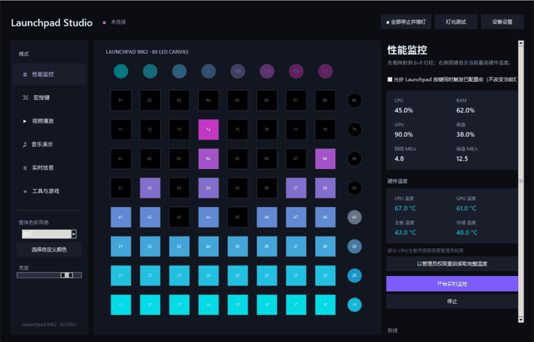
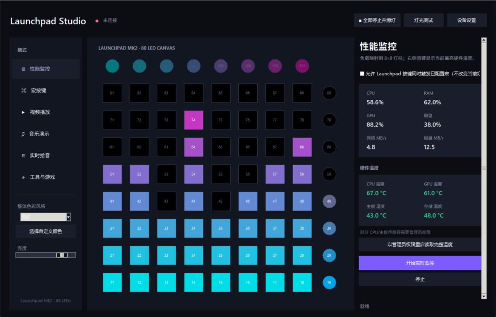
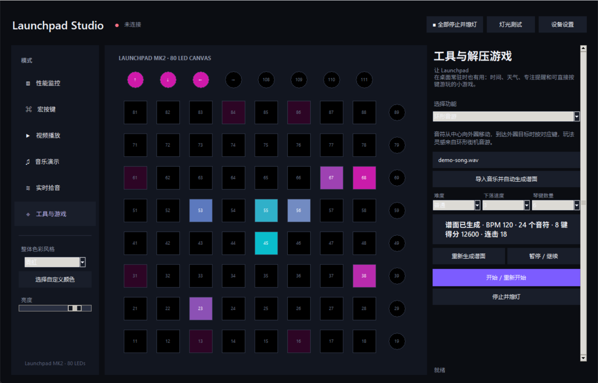

# Launchpad Studio

**中文** | [English](#english)

面向 Novation Launchpad 全系列的 Windows 桌面控制中心：硬件监控、宏按键、音视频像素灯光、实时拾音、桌面工具与可游玩的灯光游戏全部集中在一个无终端窗口、可常驻托盘的软件中。

A Windows desktop control center for the Novation Launchpad family, combining hardware telemetry, macro pads, pixel video, music and live-audio lighting, desktop utilities, and playable LED games in one tray-ready application.

<p align="center">
  
</p>

<p align="center">
  <a href="docs/media/launchpad-studio-demo.mp4">观看高清 MP4 演示 / Watch the HD MP4 demo</a>
</p>

## 中文介绍

### 下载与启动

从 [最新 Release](https://github.com/YUHU-1st/launchpad-studio/releases/latest) 下载 Windows x64 压缩包，解压后运行 `LaunchpadStudio.exe`，无需安装 Python。

1. 连接 Launchpad，并关闭可能独占 MIDI 端口的 Ableton 等软件。
2. 启动程序，使用自动型号识别，或手动选择设备型号及 MIDI 输入/输出。
3. 打开需要的页面完成设置，然后点击“开始”“播放”或“启用”让该模式接管灯光。

仅浏览其他模式页面不会打断当前灯光、音频、游戏或性能监控。关闭主窗口后软件继续在系统托盘运行；右键托盘图标可重新打开或完全退出。顶部的“全部停止并熄灯”可以立即结束所有活动并关闭全部 LED。

### 主要功能

- **性能与温度监控**：显示 CPU、内存、GPU、磁盘、网络和磁盘吞吐量，以及 CPU、GPU、主板和存储温度。
- **宏按键**：每个键可独立设置颜色与热键、文字输入、程序/文件、网址、命令、PowerShell、媒体控制、按键序列、鼠标操作、系统操作、音量和多步骤组合动作；支持单独清除指定按键。
- **宏与灯光并行**：在性能、视频、音乐、实时拾音、时钟、日历、天气和专注计时等非游戏模式开启宏控制后，灯光演示保持不变，实体按键仍可触发宏。游戏运行时输入自动优先交给游戏。
- **视频像素播放器**：播放列表、拖动进度、上下一个、暂停、0.5×–3× 变速、循环，以及原色、热图、边缘、辉光、万花筒和故障滤镜。
- **音乐灯光秀**：离线分析 BPM、情绪、能量和风格，提供频谱、波形、涟漪、星云、火焰、隧道等多种灯效并与声音同步。
- **实时拾音**：支持麦克风和 Windows WASAPI 系统回放，提供频率范围、响度范围、灵敏度、噪声阈值、速度和扩散等低延迟参数。
- **参数与预设**：自动记忆上次设置，支持恢复默认、命名预设、最近预设，以及音乐、拾音和视频模式间复制粘贴兼容参数。
- **桌面工具**：数字时钟、日历、免密钥实时天气和专注计时器。
- **解压游戏**：可调难度与自动关卡的穿墙贪吃蛇、打地鼠、得分庆祝灯效和实时计分板。
- **自动谱面音游**：导入 WAV、MP3、OGG、FLAC 或 AIFF 后，软件预先识别节拍、瞬态和频段并自动生成谱面。瀑布音游与环形街机风格音游均支持简单/普通/困难、1–5 级音符速度、4–8 个琴键、暂停/继续、连击、判定、准确率和最高分。

### 界面截图

| 性能与硬件温度监控 | 自动谱面环形音游 |
| --- | --- |
|  |  |

### 支持设备

内置 Launchpad MK1、Launchpad S、Launchpad Mini MK1/MK2/MK3、Launchpad MK2、Launchpad X、Launchpad Pro 和 Launchpad Pro MK3 布局。RGB 设备输出全彩灯光，红绿双色旧型号会自动执行最接近的颜色转换；Pro 型号额外适配左侧和底部控制行。

### 源码运行与构建

双击 `LaunchpadStudio.vbs` 或 `start.bat` 可静默准备环境并启动；`安装桌面快捷方式.bat` 用于创建桌面快捷方式，`build_exe.bat` 用于生成 Windows 分发包。

```powershell
.\.venv\Scripts\python.exe -m unittest discover -s tests -v
```

配置和预设保存在 `data/settings.json`，崩溃诊断写入 `data/crash.log` 与 `data/native_crash.log`。天气数据来自 [Open-Meteo](https://open-meteo.com/)，无需 API Key。

---

## English

### Download and start

Download the Windows x64 package from the [latest release](https://github.com/YUHU-1st/launchpad-studio/releases/latest), extract it, and run `LaunchpadStudio.exe`. Python is not required.

1. Connect a Launchpad and close Ableton or any application that may own its MIDI ports.
2. Start Launchpad Studio and use automatic model detection, or select the model and MIDI ports manually.
3. Configure a page, then press its Start, Play, or Enable button to hand LED ownership to that mode.

Browsing another page does not interrupt the current lighting, audio, game, or performance monitor. Closing the main window keeps the service in the notification area. Use the tray menu to reopen or exit, or press **Stop All and Black Out** in the header to end every activity and switch off all LEDs immediately.

### Highlights

- **Performance and temperature monitoring:** CPU, memory, GPU, disk, network and storage throughput, plus CPU, GPU, motherboard and drive temperatures.
- **Per-pad macros:** colors and actions for hotkeys, text, files/apps, URLs, commands, PowerShell, media keys, key sequences, mouse actions, system actions, volume, and multi-step combined workflows. Any selected pad can be cleared independently.
- **Macros alongside lighting:** enable parallel macro control on any non-game mode. The active animation remains untouched while physical pads trigger their configured macros; games automatically retain input priority.
- **Pixel video player:** playlists, seeking, previous/next, pause, 0.5x–3x speed, loop modes, and original-color, heatmap, edge, glow, kaleidoscope, and glitch filters.
- **Analyzed music shows:** offline BPM, mood, energy and style analysis with synchronized spectrum, waveform, ripple, nebula, flame, tunnel, and other visual styles.
- **Low-latency live audio:** microphone and Windows WASAPI loopback capture with frequency, loudness, sensitivity, gate, speed, and spread controls.
- **Persistent parameters and presets:** automatic restore, defaults, named and recent presets, plus compatible parameter copy/paste across music, live audio, and video.
- **Desktop utilities:** digital clock, calendar, key-free live weather, and a focus timer.
- **Casual games:** difficulty levels, automatic stages, wrap-around Snake, slower Whack-a-Mole, live scoreboards, and score celebration effects.
- **Auto-chart rhythm games:** import WAV, MP3, OGG, FLAC, or AIFF and analyze beats, transients, and frequency bands before play. Waterfall and radial arcade-style games support Easy/Normal/Hard charts, note speed 1–5, 4–8 lanes, pause/resume, combo, timing grades, accuracy, and high scores.

### Screenshots

| Performance and hardware temperatures | Auto-chart radial rhythm game |
| --- | --- |
|  |  |

### Supported hardware

Built-in profiles cover Launchpad MK1, Launchpad S, Launchpad Mini MK1/MK2/MK3, Launchpad MK2, Launchpad X, Launchpad Pro, and Launchpad Pro MK3. RGB devices receive full color; legacy red/green devices receive automatic nearest-color conversion. Pro layouts also include their left and bottom control rows.

### Development and packaging

Double-click `LaunchpadStudio.vbs` or `start.bat` for silent environment setup and launch. Use `安装桌面快捷方式.bat` to create a desktop shortcut and `build_exe.bat` to create the Windows distribution.

```powershell
.\.venv\Scripts\python.exe -m unittest discover -s tests -v
```

Settings and presets live in `data/settings.json`; diagnostics are written to `data/crash.log` and `data/native_crash.log`. Weather data is provided by [Open-Meteo](https://open-meteo.com/) without an API key.

Launchpad is a trademark of Focusrite Audio Engineering Ltd. This independent project is not affiliated with or endorsed by Novation.
