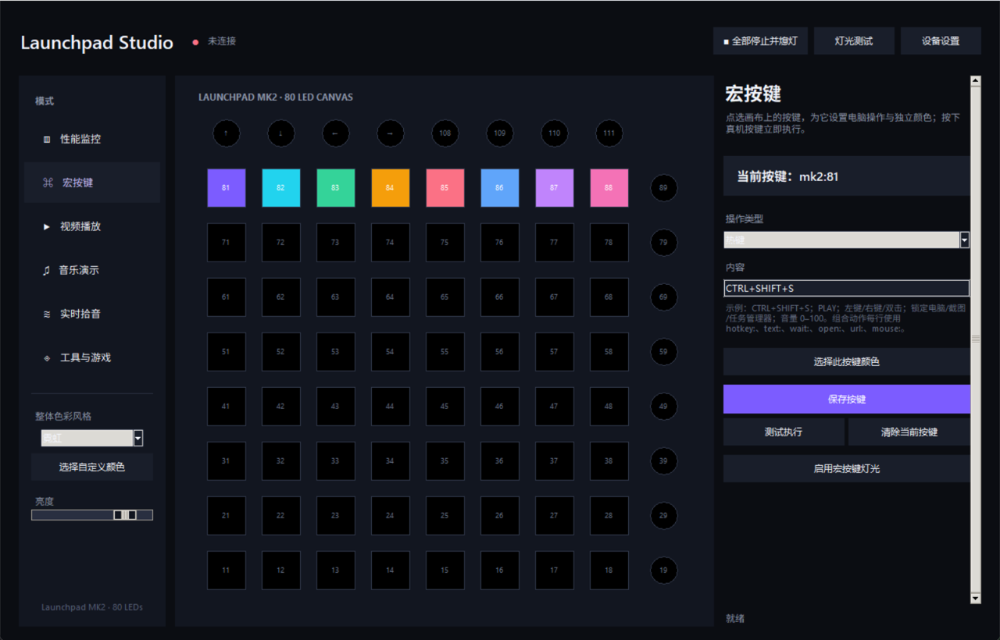
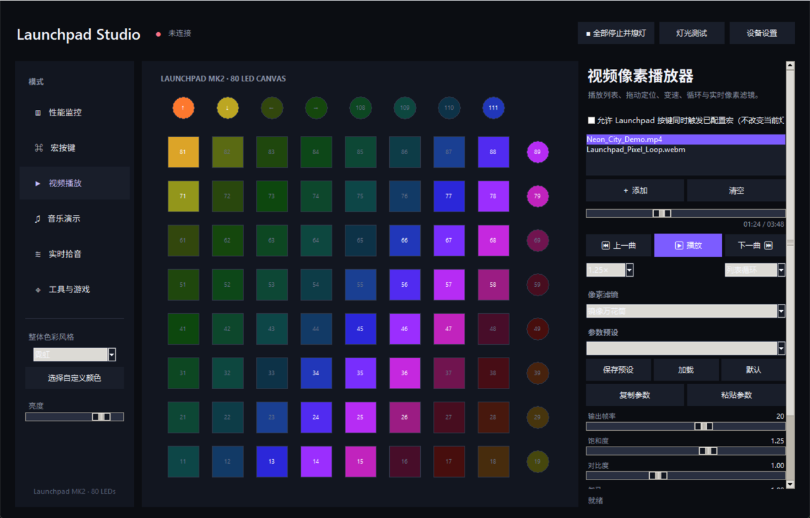
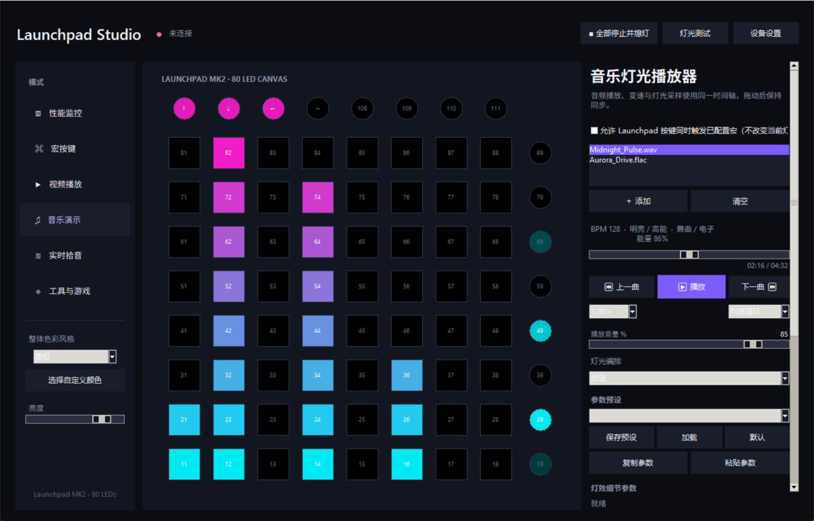
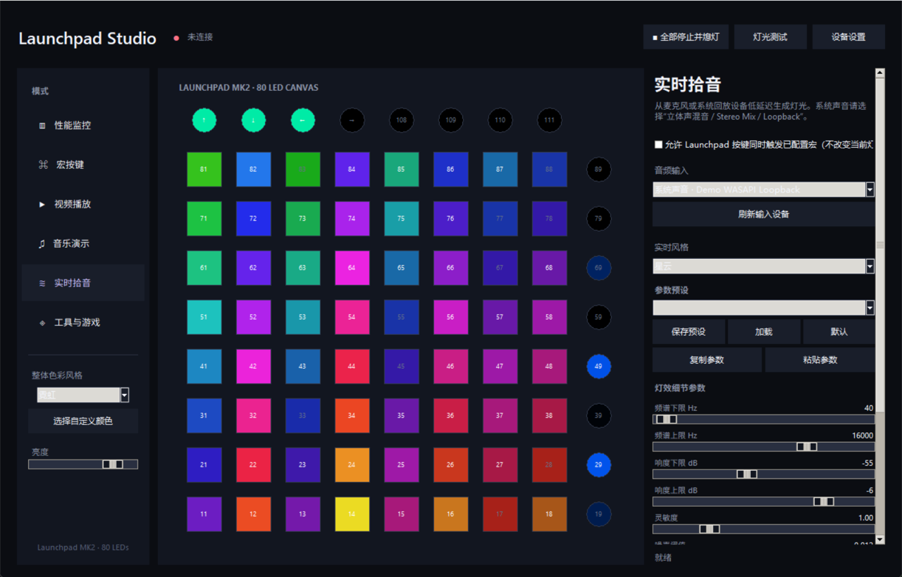
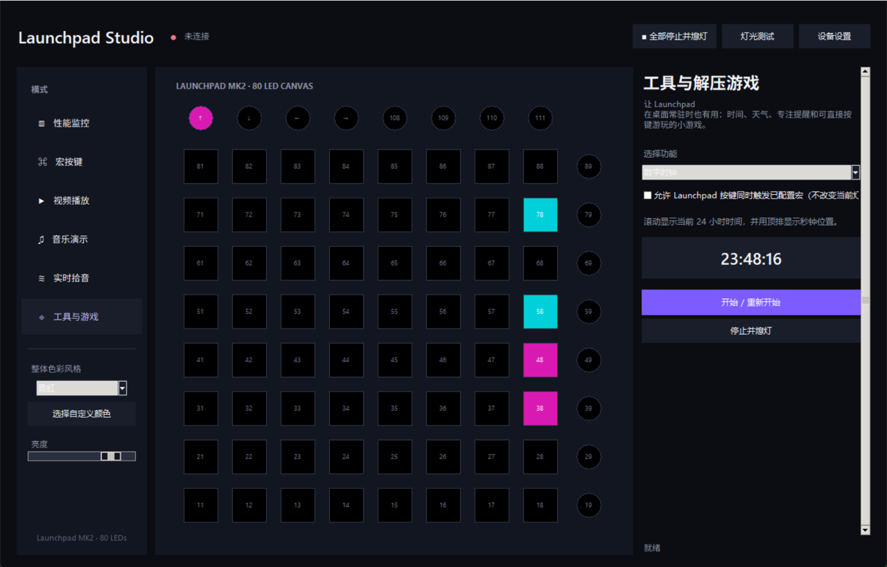
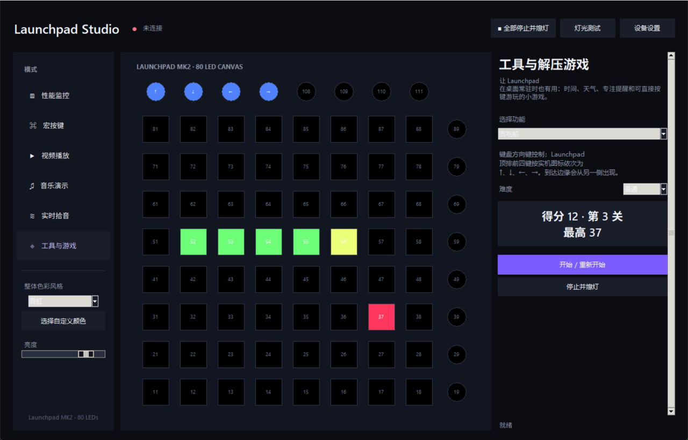
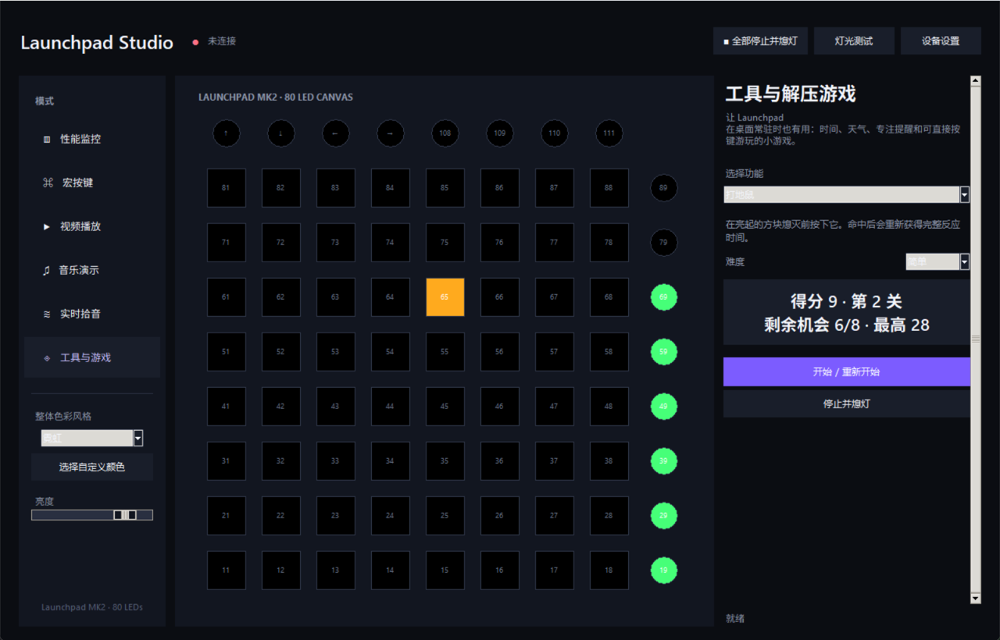
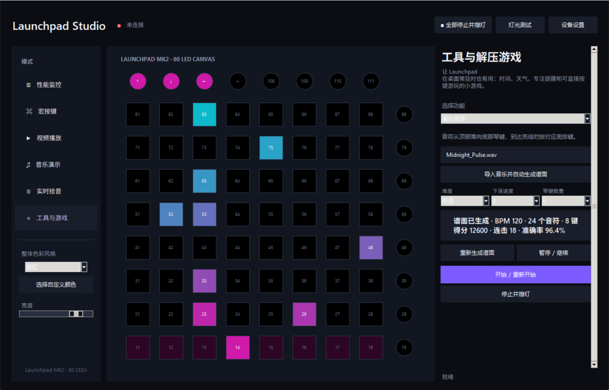

# Launchpad Studio

**中文** | [English](#english)

面向 Novation Launchpad 全系列的 Windows 桌面控制中心：硬件监控、宏按键、音视频像素灯光、实时拾音、桌面工具与可游玩的灯光游戏全部集中在一个无终端窗口、可常驻托盘的软件中。

A Windows desktop control center for the Novation Launchpad family, combining hardware telemetry, macro pads, pixel video, music and live-audio lighting, desktop utilities, and playable LED games in one tray-ready application.

<p align="center">
  
</p>

<p align="center">
  <a href="docs/media/launchpad-studio-demo.mp4">观看全模式高清 MP4 演示 / Watch the all-mode HD MP4 demo</a>
</p>

演示依次覆盖性能监控、宏按键、视频播放、音乐演示、实时拾音、时钟/日历/天气/专注工具、贪吃蛇、打地鼠、瀑布音游和环形音游。下方另有每项功能的独立视频。

The overview covers performance, macros, video, music, live audio, clock/calendar/weather/focus tools, Snake, Whack-a-Mole, Waterfall, and the radial rhythm game. Individual feature videos are linked below.

## 中文介绍

### 下载与启动

从 [最新 Release](https://github.com/YUHU-1st/launchpad-studio/releases/latest) 下载 Windows x64 压缩包，解压后运行 `LaunchpadStudio.exe`，无需安装 Python。

1. 连接 Launchpad，并关闭可能独占 MIDI 端口的 Ableton 等软件。
2. 启动程序，使用自动型号识别，或手动选择设备型号及 MIDI 输入/输出。
3. 打开需要的页面完成设置，然后点击“开始”“播放”或“启用”让该模式接管灯光。

仅浏览其他模式页面不会打断当前灯光、音频、游戏或性能监控。关闭主窗口后软件继续在系统托盘运行；右键托盘图标可重新打开或完全退出。顶部的“全部停止并熄灯”可以立即结束所有活动并关闭全部 LED。

### 主要功能

- **性能与温度监控**：显示 CPU、内存、GPU、磁盘、网络和磁盘吞吐量，以及 CPU、GPU、主板和存储温度。
- **宏按键**：每个键可独立设置颜色与热键、文字输入、程序/文件、网址、命令、PowerShell、媒体控制、按键序列、鼠标操作、系统操作、音量和多步骤组合动作；支持单独清除指定按键。
- **宏与灯光并行**：在性能、视频、音乐、实时拾音、时钟、日历、天气和专注计时等非游戏模式开启宏控制后，灯光演示保持不变，实体按键仍可触发宏。游戏运行时输入自动优先交给游戏。
- **视频像素播放器**：播放列表、拖动进度、上下一个、暂停、0.5×–3× 变速、循环，以及原色、热图、边缘、辉光、万花筒和故障滤镜。
- **音乐灯光秀**：离线分析 BPM、情绪、能量和风格，提供频谱、波形、涟漪、星云、火焰、隧道等多种灯效并与声音同步。
- **实时拾音**：支持麦克风和 Windows WASAPI 系统回放，提供频率范围、响度范围、灵敏度、噪声阈值、速度和扩散等低延迟参数。
- **参数与预设**：自动记忆上次设置，支持恢复默认、命名预设、最近预设，以及音乐、拾音和视频模式间复制粘贴兼容参数。
- **桌面工具**：数字时钟、日历、免密钥实时天气和专注计时器。
- **解压游戏**：可调难度与自动关卡的穿墙贪吃蛇、打地鼠、得分庆祝灯效和实时计分板。
- **自动谱面音游**：导入 WAV、MP3、OGG、FLAC 或 AIFF 后，软件预先识别节拍、瞬态和频段并自动生成谱面。瀑布音游与环形街机风格音游均支持简单/普通/困难、1–5 级音符速度、4–8 个琴键、暂停/继续、连击、判定、准确率和最高分。

### 界面截图

每段独立视频都录制真实软件界面与同步的虚拟 Launchpad 灯板，便于在下载前完整预览操作区、参数和灯效。

#### 1. 性能与温度监控

将 CPU、内存、GPU、磁盘、网络与磁盘吞吐量映射成动态灯柱，圆形控制键显示最高温度趋势；界面同时列出 CPU、GPU、主板和存储温度，并提示传感器权限状态。支持整体配色、亮度和并行宏控制。

[观看独立视频](docs/media/performance-demo.mp4)


#### 2. 宏按键

点击屏幕键位即可配置单键颜色和操作，支持热键、文字、文件/程序、网址、命令、PowerShell、媒体键、按键序列、鼠标、系统操作、音量及带等待步骤的组合动作。可测试、覆盖或只清除当前按键；非游戏灯效运行时也能独立启用宏控制。

[观看独立视频](docs/media/macros-demo.mp4)



#### 3. 视频像素播放器

把视频实时缩放到对应 Launchpad 布局，提供可拖动进度条、上下一个、播放/暂停、0.5×–3× 速度、列表/单曲/不循环和播放列表。原色、热图、边缘、单色辉光、万花筒、故障滤镜可继续调节帧率、饱和度、对比度、伽马与阈值，并支持预设及跨模式参数复制。

[观看独立视频](docs/media/video-player-demo.mp4)



#### 4. 音乐灯光播放器

导入音频后离线识别 BPM、情绪、能量和风格，音频播放、变速、定位与灯光使用同一时间轴。频谱、对称频谱、波形、脉冲、涟漪、星云、雨幕、火焰、隧道和棋盘均可调频段、响度、灵敏度、噪声阈值、速度与扩散，并保存为预设。

[观看独立视频](docs/media/music-show-demo.mp4)



#### 5. 实时拾音

可选择麦克风或 Windows WASAPI 系统回放设备，以约 20–45 ms 目标延迟驱动完整音乐可视化引擎。输入设备、风格、频率/响度范围、灵敏度、门限、速度、扩散、配色和亮度均可实时调整并自动记忆。

[观看独立视频](docs/media/live-audio-demo.mp4)



#### 6. 桌面工具

数字时钟滚动显示 24 小时时间，日历显示日期与星期进度，天气无需 API Key 即可展示气温、体感、降水、湿度和风速，专注计时器支持 1–180 分钟及暂停/继续。独立视频依次预览四项工具及对应灯板画面。

[观看独立视频](docs/media/desktop-utilities-demo.mp4)



#### 7. 贪吃蛇

键盘或实机顶排 `↑ ↓ ← →` 控制，越过任意边缘会从对侧出现；简单/普通/困难影响移动节奏，得分自动提升关卡速度。界面实时显示得分、关卡和最高分，吃到食物时播放庆祝灯效。

[观看独立视频](docs/media/snake-demo.mp4)



#### 8. 打地鼠

按下随机亮起的实体按键得分，每次命中会刷新完整反应时间；难度控制反应窗口与机会数量，关卡随得分提升。剩余机会同时显示在侧边灯列和实时计分板，命中触发得分光效。

[观看独立视频](docs/media/whack-a-mole-demo.mp4)



#### 9. 瀑布音游

导入音乐后预先分析节拍、瞬态和频段生成谱面，音符从顶部落向底部判定线。可选简单/普通/困难、1–5 级速度和 4–8 键；支持暂停/继续，并实时统计 Perfect/Great/Good/Miss、连击、准确率、得分与最高分。

[观看独立视频](docs/media/waterfall-demo.mp4)



#### 10. 环形音游

使用同一套音乐分析器自动编谱，音符从中心向 Launchpad 外圈目标扩散，形成类似环形街机音游的演奏体验。难度、速度、键数、暂停、判定、连击、准确率和最高分功能与瀑布模式一致。

[观看独立视频](docs/media/radial-rhythm-demo.mp4)


### 支持设备

内置 Launchpad MK1、Launchpad S、Launchpad Mini MK1/MK2/MK3、Launchpad MK2、Launchpad X、Launchpad Pro 和 Launchpad Pro MK3 布局。RGB 设备输出全彩灯光，红绿双色旧型号会自动执行最接近的颜色转换；Pro 型号额外适配左侧和底部控制行。

### 源码运行与构建

双击 `LaunchpadStudio.vbs` 或 `start.bat` 可静默准备环境并启动；`安装桌面快捷方式.bat` 用于创建桌面快捷方式，`build_exe.bat` 用于生成 Windows 分发包。

```powershell
.\.venv\Scripts\python.exe -m unittest discover -s tests -v
```

配置和预设保存在 `data/settings.json`，崩溃诊断写入 `data/crash.log` 与 `data/native_crash.log`。天气数据来自 [Open-Meteo](https://open-meteo.com/)，无需 API Key。

---

## English

### Download and start

Download the Windows x64 package from the [latest release](https://github.com/YUHU-1st/launchpad-studio/releases/latest), extract it, and run `LaunchpadStudio.exe`. Python is not required.

1. Connect a Launchpad and close Ableton or any application that may own its MIDI ports.
2. Start Launchpad Studio and use automatic model detection, or select the model and MIDI ports manually.
3. Configure a page, then press its Start, Play, or Enable button to hand LED ownership to that mode.

Browsing another page does not interrupt the current lighting, audio, game, or performance monitor. Closing the main window keeps the service in the notification area. Use the tray menu to reopen or exit, or press **Stop All and Black Out** in the header to end every activity and switch off all LEDs immediately.

### Highlights

- **Performance and temperature monitoring:** CPU, memory, GPU, disk, network and storage throughput, plus CPU, GPU, motherboard and drive temperatures.
- **Per-pad macros:** colors and actions for hotkeys, text, files/apps, URLs, commands, PowerShell, media keys, key sequences, mouse actions, system actions, volume, and multi-step combined workflows. Any selected pad can be cleared independently.
- **Macros alongside lighting:** enable parallel macro control on any non-game mode. The active animation remains untouched while physical pads trigger their configured macros; games automatically retain input priority.
- **Pixel video player:** playlists, seeking, previous/next, pause, 0.5x–3x speed, loop modes, and original-color, heatmap, edge, glow, kaleidoscope, and glitch filters.
- **Analyzed music shows:** offline BPM, mood, energy and style analysis with synchronized spectrum, waveform, ripple, nebula, flame, tunnel, and other visual styles.
- **Low-latency live audio:** microphone and Windows WASAPI loopback capture with frequency, loudness, sensitivity, gate, speed, and spread controls.
- **Persistent parameters and presets:** automatic restore, defaults, named and recent presets, plus compatible parameter copy/paste across music, live audio, and video.
- **Desktop utilities:** digital clock, calendar, key-free live weather, and a focus timer.
- **Casual games:** difficulty levels, automatic stages, wrap-around Snake, slower Whack-a-Mole, live scoreboards, and score celebration effects.
- **Auto-chart rhythm games:** import WAV, MP3, OGG, FLAC, or AIFF and analyze beats, transients, and frequency bands before play. Waterfall and radial arcade-style games support Easy/Normal/Hard charts, note speed 1–5, 4–8 lanes, pause/resume, combo, timing grades, accuracy, and high scores.

### Screenshots

Each feature video records the real application UI and synchronized virtual Launchpad canvas, so its controls, parameters, and LED output can be previewed before downloading.

#### 1. Performance and temperatures

Maps CPU, memory, GPU, disk, network, and storage throughput to animated LED columns. Round controls visualize the hottest sensor while the panel reports CPU, GPU, motherboard, and drive temperatures and sensor permission status. Global palette, brightness, and parallel macro control remain available.

[Watch this feature](docs/media/performance-demo.mp4)


#### 2. Per-pad macros

Click a visual pad to assign its color and action: hotkey, text, file/app, URL, command, PowerShell, media key, key sequence, mouse, system command, volume, or a multi-step workflow with delays. Test, overwrite, or clear only the selected pad, and optionally run macros independently over any non-game light show.

[Watch this feature](docs/media/macros-demo.mp4)


#### 3. Pixel video player

Downscales video in real time to the active Launchpad layout, with a draggable timeline, previous/next, play/pause, 0.5x–3x speed, playlist, and no-loop/single/list loop modes. Original, heatmap, edge, monochrome glow, kaleidoscope, and glitch filters expose FPS, saturation, contrast, gamma, and threshold controls with presets and cross-mode copy/paste.

[Watch this feature](docs/media/video-player-demo.mp4)


#### 4. Analyzed music light show

Offline analysis identifies BPM, mood, energy, and style. Playback, speed, seeking, and LEDs share one timeline. Spectrum, mirrored spectrum, waveform, pulse, ripple, nebula, rain, flame, tunnel, and checkerboard styles expose frequency, loudness, sensitivity, gate, speed, and spread controls that can be saved as presets.

[Watch this feature](docs/media/music-show-demo.mp4)


#### 5. Live audio capture

Select a microphone or Windows WASAPI loopback input and drive the full visualization engine at a target latency of roughly 20–45 ms. Device, style, frequency/loudness range, sensitivity, gate, speed, spread, palette, and brightness update live and persist automatically.

[Watch this feature](docs/media/live-audio-demo.mp4)


#### 6. Desktop utilities

The digital clock scrolls 24-hour time, Calendar shows date and weekday progress, key-free Weather displays temperature, apparent temperature, rain, humidity, and wind, and Focus Timer supports 1–180 minutes with pause/resume. The feature video previews all four tools and their LED frames in sequence.

[Watch this feature](docs/media/desktop-utilities-demo.mp4)


#### 7. Snake

Use the keyboard or the physical top-row `↑ ↓ ← →` controls. Crossing any edge wraps to the opposite side; Easy/Normal/Hard changes pacing and score-driven stages increase speed. The panel updates score, stage, and high score live, with a celebration effect after food is collected.

[Watch this feature](docs/media/snake-demo.mp4)


#### 8. Whack-a-Mole

Hit the randomly lit physical pad before it expires; every successful hit restores the full response window. Difficulty controls timing and available chances while stages increase with score. Remaining chances appear on both the side LED column and live scoreboard, and hits trigger a score effect.

[Watch this feature](docs/media/whack-a-mole-demo.mp4)


#### 9. Waterfall rhythm game

Import music to analyze beats, transients, and bands before generating a chart. Notes descend toward the bottom judgment line. Choose Easy/Normal/Hard, speed 1–5, and 4–8 lanes; pause/resume and live Perfect/Great/Good/Miss, combo, accuracy, score, and high-score tracking are included.

[Watch this feature](docs/media/waterfall-demo.mp4)


#### 10. Radial rhythm game

The same music analyzer generates a chart whose notes expand from the center toward outer Launchpad targets for a radial arcade-style experience. Difficulty, speed, lane count, pause, grades, combo, accuracy, score, and high-score controls match Waterfall mode.

[Watch this feature](docs/media/radial-rhythm-demo.mp4)


### Supported hardware

Built-in profiles cover Launchpad MK1, Launchpad S, Launchpad Mini MK1/MK2/MK3, Launchpad MK2, Launchpad X, Launchpad Pro, and Launchpad Pro MK3. RGB devices receive full color; legacy red/green devices receive automatic nearest-color conversion. Pro layouts also include their left and bottom control rows.

### Development and packaging

Double-click `LaunchpadStudio.vbs` or `start.bat` for silent environment setup and launch. Use `安装桌面快捷方式.bat` to create a desktop shortcut and `build_exe.bat` to create the Windows distribution.

```powershell
.\.venv\Scripts\python.exe -m unittest discover -s tests -v
```

Settings and presets live in `data/settings.json`; diagnostics are written to `data/crash.log` and `data/native_crash.log`. Weather data is provided by [Open-Meteo](https://open-meteo.com/) without an API key.

Launchpad is a trademark of Focusrite Audio Engineering Ltd. This independent project is not affiliated with or endorsed by Novation.
