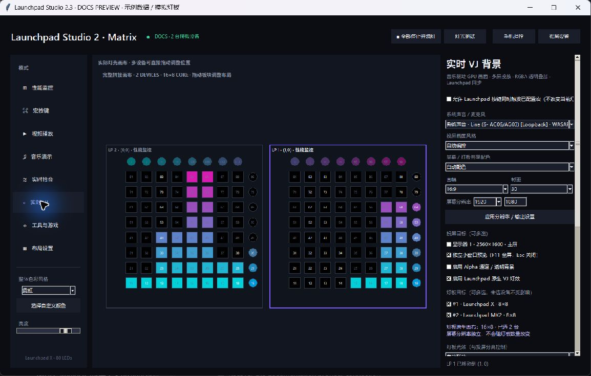
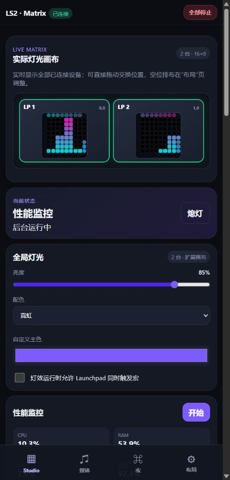

# Launchpad Studio user guide

[Project overview](../README.md) · [中文使用指南](GUIDE_ZH.md) · [Screenshots and videos](SHOWCASE.md) · [Development](DEVELOPMENT.md)

Launchpad Studio turns compatible Novation Launchpads into a Windows macro controller, live LED canvas, music visualizer and game surface. It also creates audio-reactive VJ backgrounds for computer displays. An Android app or mobile browser can remotely control the non-game features over your local network.

The application interface currently uses Chinese labels. This guide includes the labels you need to find each control; the bilingual documentation does not imply an English-interface setting.

## Install, start and update

### Windows

1. Download `LaunchpadStudio-<version>-windows-x64.zip` from [GitHub Releases](https://github.com/YUHU-1st/launchpad-studio/releases/latest). Choose the release ZIP, not GitHub's **Source code** archive.
2. Extract the entire ZIP to a writable folder. Keep `LaunchpadStudio.exe` and its `_internal` folder together; do not run the executable from inside the ZIP. The packaged application does not require Python.
3. Connect your Launchpad by USB. Close applications that may already hold its MIDI ports, such as a DAW, when connecting fails.
4. Run `LaunchpadStudio.exe`, open **布局设置** (Layout Settings), and click **扫描并连接全部 Launchpad** (Scan and Connect All Launchpads).
5. Open a feature page and click its **开始**, **播放** or **启用** button. Selecting a page alone does not replace the running show.

Use a current Windows x64 environment. VJ requires an OpenGL 3.3-capable graphics driver; attainable resolution and frame rate depend on the GPU and output count. CPU, motherboard and drive temperature readings additionally depend on available sensors, permissions and the optional .NET 8 temperature helper. Unavailable readings do not mean the rest of the software cannot work.

To update, fully exit the old application from its tray menu and back up the old folder's `data` directory. Extract the new release to a separate folder, then copy the backed-up `data` directory into it before starting. Keep the old release and backup until you have checked the update. Do not mix old `_internal` libraries into a new release, and keep imported media at their existing paths.

### Android or a mobile browser

The Android companion requires Android 8.0 or newer; DJI RC Plus on Android 10 has been tested. Install `LaunchpadStudioRemote-<version>-android.apk` from the same release. Your device may ask you to allow APK installation from the browser or file manager. To update, install the newer APK over the existing app using the project's release package; uninstalling first removes the app's saved connection details.

The phone is a remote for the running Windows application, not a standalone Launchpad driver. You can also use a mobile browser without installing the APK. See [pairing](#phone-remote-and-windows-media).

## Navigation, color and stopping a show

The desktop has eight pages: **性能监控**, **宏按键**, **视频播放**, **音乐演示**, **实时拾音**, **实时 VJ**, **工具与游戏** and **布局设置**. The live pad-layout preview stays visible while you browse.

Changing pages does not stop the active output. In Extended or Mirror layouts, starting another ordinary LED mode replaces the previous one. Independent layouts can keep different feature modes running on different devices. VJ projection can continue when another mode takes over its LEDs.

Choose a global palette (**霓虹**, **海洋**, **日落**, **森林**, **单色**) or a custom main color, then adjust brightness. Macro pads can have individual colors. VJ has its own shared screen/LED palette and can choose it automatically; video original-color playback retains its source colors. A palette is not an individual-color editor for every pixel in every mode.

Click **全部停止并熄灯** (Stop All and Black Out) for an immediate global stop: music, video, capture, VJ windows and LEDs stop together. Closing the main window instead hides it to the system tray and leaves active features running. Right-click the tray icon to reopen the interface or choose **完全退出程序** (Exit Completely). This is tray residency, not an installed Windows service or automatic Windows-startup feature.

## Layout Settings: connect and arrange multiple pads

[Layout screenshots and walkthrough](SHOWCASE.md#layout) · [Layout walkthrough video](media/layout-demo.mp4)

1. Open **布局设置** and use **扫描并连接全部 Launchpad**. The app detects models, pairs MIDI inputs/outputs and numbers the devices.
2. Click **在实机显示编号** to display a device number on its LEDs and identify the corresponding physical pad.
3. Drag device tiles in the live canvas to match the physical arrangement. Dropping a tile on another device swaps positions. Horizontal, vertical and irregular arrangements change the preview's proportions.
4. Select the routing behavior:

| Routing label | What happens | Where to start a feature |
| --- | --- | --- |
| **扩展画布** — Extended | Pads form a native wider/taller canvas, rather than stretching an 8×8 image. | The normal feature page, for the whole layout. |
| **复制画面** — Mirror | Each pad receives the same show. | The normal feature page, for all mirrored pads. |
| **独立模式** — Independent | Each device can be assigned a different feature source. | Assign sources in Layout Settings, then start each needed feature page. |

One normal pad has an 8×8 main grid; two adjacent pads produce 16×8 or 8×16 in Extended mode. Native performance bars, spectra, video and tools/games use the available display area. Independent devices are routed separately, but each feature still has one shared engine and settings: assigning Music to two pads does not create two independent music players. Tools and games likewise share the selected utility/game.

VJ can reserve a selected subset of pads while the others keep their existing mode. Its selected-pad resolution follows their positions, including layout gaps; in Mirror it remains 8×8 per device. Its screen resolution is independent of the pad layout.

The documentation layout image and walkthrough use sample settings and virtual pads. They explain the interface; they are not footage of physical hardware responding.

## Performance and temperature monitoring

[Preview](SHOWCASE.md#performance) · [Feature video](media/performance-demo.mp4)

Open **性能监控**, choose the palette/brightness and click **开始实时监控**. LED columns show CPU and memory use, C-drive capacity use, network and disk throughput, GPU use when available, and CPU-core activity. The interface also lists CPU, GPU, motherboard and storage temperatures when their sensors can be read.

GPU utilization currently uses NVIDIA's `nvidia-smi`; do not expect equivalent utilization readings on every AMD or Intel GPU. The temperature helper uses LibreHardwareMonitor, with NVIDIA and supported OEM fallbacks. **以管理员权限重启读取完整温度** can help with restricted sensors, but elevation cannot create a sensor your hardware does not expose. A missing value is shown as unavailable, not an invented temperature.

Enable the parallel macro switch if you want pad presses to trigger configured macros without replacing the monitoring animation.

## Macro pads

[Preview](SHOWCASE.md#macros) · [Feature video](media/macros-demo.mp4)

1. Open **宏按键** and click a pad in the visual layout.
2. Choose an action, enter its value and optionally choose **选择此按键颜色**.
3. Click **保存按键**. **测试执行** executes the actual action; test typing/keyboard macros in a disposable editor rather than an important document.
4. **启用宏按键灯光** displays configured pad colors. **清除当前按键** removes only that pad's action and color.

| Action | Example or use |
| --- | --- |
| **热键** — Hotkey | `CTRL+SHIFT+ESC` opens Task Manager. |
| **输入文字** — Type text | Types a saved phrase into the focused application. |
| **打开文件/程序** — Open file/app | A full local file or executable path. |
| **打开网址** — Open URL | A website address opened by the default browser. |
| **执行命令** / **PowerShell** | A command executed on the Windows computer; only use commands you trust. |
| **媒体控制** — Media key | `PLAY`, `NEXT`, `PREV`, `MUTE`, `VOLUMEUP`, `VOLUMEDOWN`. |
| **按键序列** — Key sequence | Comma-separated hotkeys, such as `CTRL+A, CTRL+C`. |
| **鼠标操作** — Mouse | Left/right/middle clicks or a double click. |
| **系统操作** — System action | Lock, screenshot, Task Manager, Explorer or show desktop. |
| **设置音量** — Set volume | A value from `0` to `100`, using Windows volume keys. |
| **组合动作** — Combined steps | One action per line: `hotkey: CTRL+A`, `wait: 100`, `text: Hello`. Wait values are milliseconds. |

The macro bank uses logical pad positions, so a configured position works across supported models. It is not a separate macro bank for each connected device. Non-game pages have a switch allowing configured macros to run alongside their lights; game input takes priority on devices assigned to a running game. Individual macro colors are displayed in Macro mode, not overlaid onto unrelated shows.

## Pixel video player

[Preview](SHOWCASE.md#video) · [Feature video](media/video-player-demo.mp4)

Open **视频播放**, click **＋ 添加**, select local video files and choose an item in the playlist. Click **播放**, drag the timeline to seek, or use Previous/Next and Pause/Resume. Choose 0.5×–3× speed and **不循环** (no loop), **单曲循环** (repeat item) or **列表循环** (repeat list).

The file chooser lists MP4, AVI, MOV, MKV and WebM; actual decoding depends on the bundled decoder and file codec. The mode renders the visual frames to the selected Launchpad canvas; it does not play the video's audio track. There is no converted-video export workflow.

Choose original colors, brightness heatmap, edge outlines, monochrome glow, mirrored kaleidoscope or pixel glitch. Adjust LED FPS (5–30), saturation, contrast, gamma and edge threshold. For an 8×8 grid, bold silhouettes and high-contrast source footage are usually easier to recognize than fine photographic detail. See [parameters and presets](#parameters-and-presets).

## Music light-show player

[Preview](SHOWCASE.md#music) · [Feature video](media/music-show-demo.mp4)

Open **音乐演示**, click **＋ 添加**, and import WAV, MP3, OGG, FLAC or AIFF audio supported by the decoder. Selecting/playing a track analyzes its rhythm and spectrum. Playback and LEDs follow the same audio cursor, so seeking, pausing and track changes remain synchronized.

The player supports playlists, previous/next, seek, pause/resume, volume, 0.5×–3× speed and the three loop modes. Playback speed uses sample resampling, so pitch changes with speed; it is not pitch-preserving time stretching.

Choose one of ten styles: spectrum, mirrored spectrum, waveform, pulse, ripple, nebula, rain, flame, tunnel or checkerboard. Use frequency limits to emphasize bass or treble, loudness limits to match the input level, and sensitivity/noise gate to control responsiveness. Animation speed and spread affect graphics rather than audio playback speed.

BPM, energy, mood and style labels are estimates from audio features, not an AI genre classifier. This player lets you select visual styles manually; the automatic multi-scene sequencer belongs to the VJ mode.

## Live audio capture

[Preview](SHOWCASE.md#live) · [Feature video](media/live-audio-demo.mp4)

Open **实时拾音**, refresh inputs if necessary and select either **系统声音 · … · WASAPI Loopback** for music playing on the PC, or **麦克风/输入 · …** for a microphone/audio input. Select a style and click **开始实时灯光**.

Use the system-playback endpoint that actually receives your music; a different, silent output produces no useful response. Microphones may capture ambient noise, so raise the noise gate before increasing sensitivity. Frequency/loudness ranges and animation parameters are the same as the Music player and can share its presets.

This is low-latency reactive lighting, not a guaranteed measured latency. Audio drivers, buffering, processing and MIDI transport affect the final response. The input choices are Windows capture devices, not audio streamed from the Android companion.

## Real-time VJ: displays and LEDs

[Screen-style preview](SHOWCASE.md#vj) · [Native LED preview](SHOWCASE.md#vj-led) · [Detailed VJ guide](VJ.md) · [Eight screen styles](media/vj-demo.mp4) · [Twelve LED styles](media/vj-led-demo.mp4)

1. Open **实时 VJ** and select the actual system-playback endpoint or microphone.
2. Choose **自动编排** or a fixed GPU scene, and a shared screen/LED palette. The eight scenes are neon tunnel, laser matrix, starfield, fractal nebula, geometric kaleidoscope, liquid chrome, synthwave sunset and dark techno.
3. Choose aspect ratio, rendering width/height and 24/25/30/50/60 FPS. Apply the output settings. Configurable width/height range is 128–7680 × 128–4320; high resolutions are not a promise of real-time performance on every GPU.
4. Multi-select **投屏目标** monitors and/or enable a separate preview. Windows must make those monitors available as extended desktops. Each selected display shows the same complete, aspect-preserved scene, not a single picture spanning the PC screens. F11/double-click toggles fullscreen; Esc closes that output.
5. Enable **启用 Launchpad 原生 VJ 灯效**, select the pad targets, then choose the LED style and its speed/intensity/density/contrast/cutoff. Click **开始 VJ / 重新开始**.

Screen and LED graphics are deliberately separate. Native LEDs use sharp pixel shapes, true black and saturated colors; both outputs share the same analyzed beat, estimated mood and palette. LED resolution follows the chosen pads, while screen width, height and FPS remain unchanged. Unselected pads keep their previous mode. Native LED-only output needs no display window; **原画采样** (Original Image Sampling) instead downsamples the GPU picture and needs at least a preview or screen output.

Alpha enables genuine transparent RGBA desktop windows. Ordinary HDMI/DisplayPort carries the final desktop composition, not a separate alpha channel. Transparent external compositing requires compatible capture/mixing software. This release does not provide Spout, NDI, projection mesh warping, DMX or alpha-video export. Fast flashes can affect photosensitive viewers; lower intensity and rehearse with the actual venue hardware.

Tempo needs several seconds to settle; half/double-tempo ambiguities and irregular music can produce errors. Mood/style are heuristics, not guaranteed recognition or generative-AI video. Closing the last video-output window stops VJ capture and its LEDs; use LED-only configuration to run without video windows. Hiding the main application to the tray does not stop projection.

## Tools and games

Open **工具与游戏** and select a function. Changing the selected function does not start it: use **开始 / 重新开始**. Stop clears its output. On multiple pads, Extended mode grows the playable/display area rather than stretching a square frame. These functions share one selected tool/game engine.

For Extended games, arrange pads as a contiguous rectangle without gaps. Game targets use the layout's rectangular bounds; irregular or gapped layouts can place targets where no physical pad exists.

### Four desktop tools

[Tool preview](SHOWCASE.md#utilities) · [All four tools video](media/desktop-utilities-demo.mp4)

| Tool | How to use it |
| --- | --- |
| **数字时钟** — Clock | Start to scroll the current 24-hour time; top LEDs indicate seconds. |
| **日历** — Calendar | Start to show the current date and weekday progress. |
| **天气** — Weather | Enter a city and start to fetch Open-Meteo weather. It needs Internet access but no API key. The interface lists temperature, apparent temperature, daily high/low, precipitation probability, humidity and wind. Queries for the same city are cached for ten minutes; restarting refreshes the network data only after that cache expires. |
| **专注计时器** — Focus | Set 1–180 minutes and start. Use Pause/Resume or Reset; completion produces a tray notification. |

### Snake

[Preview](SHOWCASE.md#snake) · [Feature video](media/snake-demo.mp4)

Choose **贪吃蛇**, select Easy/Normal/Hard and start. Steer with keyboard arrows or the first four top-row controls, ordered **↑ ↓ ← →** according to their icons. Crossing an edge wraps to the opposite side; colliding with your body ends the game. Collect food for points and a short scoring effect. The scoreboard shows score, level and saved high score; levels increase every five points.

### Whack-a-Mole

[Preview](SHOWCASE.md#mole) · [Feature video](media/whack-a-mole-demo.mp4)

Choose **打地鼠**, select difficulty and start. Hit the lit grid pad before its response window ends. A correct hit restores the full response window; a wrong pad or timeout consumes a chance. Easy/Normal/Hard starts with 8/5/3 chances. Points raise the level every eight hits. Remaining chances appear in the sidebar LEDs and scoreboard, with a celebration effect on successful hits.

### Waterfall rhythm game

[Preview](SHOWCASE.md#waterfall) · [Feature video](media/waterfall-demo.mp4)

Choose **瀑布音游** and click **导入音乐并自动生成谱面**. Wait for the chart-ready message before starting. Choose Easy/Normal/Hard, note speed 1–5 and 4–8 lanes; difficulty/lane changes regenerate the chart, while speed changes take effect at the next start. Hit each marked bottom-grid target as the falling note reaches it. On extended layouts, the targets are spread across the enlarged canvas.

Pause/Resume stops and resumes the shared music/game timeline. Perfect/Great/Good/Miss, combo, accuracy, score and high score update as you play. Auto-charting derives playable notes from beats, transients and frequency bands; it is not an official authored chart or a chart editor.

### Radial rhythm game

[Preview](SHOWCASE.md#radial) · [Feature video](media/radial-rhythm-demo.mp4)

Choose **环形音游**, import music and wait for its chart. Notes travel from the center toward marked perimeter targets; hit the corresponding target pad when the note reaches it. Difficulty, speed, lane count, pause and scoreboard behavior match Waterfall. This is an original radial arcade-style game, not an implementation of commercial arcade software or its copyrighted charts.

Snake and Whack-a-Mole have start/restart and stop controls; they do not have the rhythm games' Pause/Resume control. All four games are desktop/physical-pad features and are intentionally unavailable from mobile.

## Parameters and presets

[Preset preview](SHOWCASE.md#presets)

Video, Music and Live Audio remember their latest detailed settings and expose **保存预设** (Save Preset), **加载** (Load), **默认** (Defaults), **复制参数** (Copy Parameters) and **粘贴参数** (Paste Parameters).

Save a descriptive name such as `Bass spectrum` or `High-contrast video`, then select it and load it when needed. Saving the same name replaces that preset. Recently used names appear first, with five recent entries per mode. Music and Live Audio share the audio preset bank; Video has its own bank.

Copy parameters on one page, switch pages and paste. Only matching fields apply: Music-to-Live transfers their common frequency, loudness, sensitivity, gate, speed and spread settings; video-only fields do not become audio thresholds. Style/rate/loop fields apply only where supported. Defaults resets that page's detailed parameters, not the entire application's macros, layout or data.

Global color/brightness, device layout, macro configuration, utility settings and VJ parameters also persist, but VJ does not currently have named presets, reset-to-default or parameter-copy controls. Restoring settings after launch does not automatically start every previously running show. The mobile UI provides preset save/load for Video/Music/Live; desktop copy/paste/default buttons are not exposed on mobile.

## Phone remote and Windows media

[Remote preview](SHOWCASE.md#remote) · [Windows Media preview](SHOWCASE.md#media) · [Mobile walkthrough](media/remote-demo.mp4)

### Pair on the local network

1. Connect the Windows PC and phone/tablet to the same reachable local network and leave the desktop app running.
2. Click **手机遥控** on the desktop. Enable the LAN service if needed; note the displayed LAN address, normally `http://<PC-IP>:8765/`, and six-digit pairing PIN.
3. If Windows prompts for firewall access, allow the application on your trusted private network.
4. In the Android app, enter the PC address and PIN and connect. Alternatively, open the address in a mobile browser and enter the PIN there.

The client stores its connection information and retries interrupted connections. A PC IP change or regenerated PIN requires updating that saved information. Browser PINs are stored on that browser/device; the Android shell saves the address/PIN in app-private preferences.

Treat the PIN like a control password. Authenticated remote clients can trigger configured computer macros. The default service uses HTTP/WebSocket on the LAN, not an encrypted Internet relay: do not forward port 8765 to the public Internet or share your profile's real PIN. You can disable the service or regenerate the PIN from the desktop dialog.

### What the phone controls

The mobile Studio, Layout, Macros and VJ sections cover non-game lights, global palette/brightness, macro editing/triggering, media-playlist controls, detailed sliders, preset save/load, input selection, desktop tools, device discovery/numbering, drag layout and VJ display/pad targets. The top live canvas reflects connected devices.

Import video/music files on the Windows desktop first. The phone can select and control those imported playlist items; it does not upload local phone files, expose the desktop file chooser or run the games. It also does not stream Windows audio to the phone.

### Windows Media is separate from Studio playlists

**Windows 媒体** controls the active Windows system-media session, such as a compatible NetEase Cloud Music, PotPlayer or AIMP session. It can show app/title/artist/album, artwork, available progress and LRCLIB lyrics, and offers play/pause, previous/next, stop, repeat and shuffle where the player exposes those capabilities. Volume/mute and default Windows output switching are computer-wide audio controls.

Seek is enabled only when Windows exposes a seek-capable timeline. Some NetEase sessions have metadata but no usable duration/seek, so their progress slider is disabled. Media-key fallbacks help with certain playback commands; they do not create missing seek/repeat/shuffle support. External-player compatibility depends on its version, configuration and Windows integration.

Lyrics are fetched using song metadata, need Internet access and may be unavailable or mismatched. Audio-output switching selects the PC's default render device, not an Android speaker or a promise that every running third-party player will immediately follow the new default.

## Supported Launchpad profiles

| Models | LED behavior |
| --- | --- |
| Launchpad Original/MK1, Launchpad S, Launchpad Mini MK1/MK2 | Legacy red/green palette; colors are converted to the nearest available output. |
| Launchpad MK2, Launchpad X, Launchpad Mini MK3 | RGB output with their corresponding MIDI layout/protocol. |
| Launchpad Pro, Launchpad Pro MK3 | RGB output with additional left and bottom control rows in the profile. |

The main-grid canvas remains 8×8 per device; control rows are not additional VJ video resolution. Automatic discovery avoids modern DAW companion ports. These are implemented model profiles, not a claim that every listed unit has been physically regression-tested with every feature. See the [VJ verification scope](VJ.md#verification--验证) and release notes for what was actually tested.

## Data, privacy and troubleshooting

The running application creates a writable `data` folder beside the Windows executable (or beside `app.py` for source runs). `data/settings.json` contains palettes, macros, layout, media paths, presets, utility settings, VJ parameters and the pairing PIN. Back it up before updates. Keep imported files at their saved paths. Do not post this file publicly without removing private paths, macro contents and PINs.

Diagnostic files are `data/crash.log` and `data/native_crash.log`. Include the app version, Windows version, device model, selected mode and reproducible steps when reporting an issue; review logs for private information before attaching them. Developer tools may create additional logs in test folders.

| Question | What to check |
| --- | --- |
| Nothing happens when I change pages. | Pages are editors/previews. Click that feature's start/play/enable control to make it active. |
| The app seems closed but its lights continue. | It is in the tray. Reopen it there or choose Exit Completely; use Stop All and Black Out for an immediate stop. |
| My Launchpad is absent or has no input. | Check USB, close MIDI-owning apps, scan again, and ensure the correct user/programmer MIDI ports are available rather than only a DAW port. |
| Macro presses do nothing over a show. | Save an action for that logical position and enable the non-game parallel macro switch. A running game has input priority. Test with an ordinary focused app; elevated apps may restrict injected input. |
| CPU or motherboard temperature is missing. | Try the optional administrator restart, check .NET 8/helper availability, and accept that some hardware exposes no supported sensors. |
| Music/live/VJ is unresponsive or always too bright. | Confirm the correct input/output endpoint, then tune sensitivity, loudness range and noise/silence gate. Do not use the music player's volume slider as microphone gain. |
| VJ slows down with multiple screens. | Lower rendering resolution, FPS and density, reduce simultaneous windows, and update the graphics driver. LED dimensions do not require increasing video resolution. |
| Transparency does not reach a projector. | HDMI/DP shows the composited picture; alpha requires a transparency-preserving capture/composition pipeline. |
| Phone cannot connect. | Check the displayed PC LAN IP, PIN, desktop service and private-network firewall; guest Wi-Fi/client isolation can block peer connections. `127.0.0.1` on a phone points to the phone, not the PC. |
| Mobile playlist is empty. | Import files on the Windows desktop; phone-local media is not uploaded. |
| External-player seek is unavailable. | The player may not expose a valid GSMTC timeline. This is separate from seeking Studio's imported audio/video. |

The older per-feature videos show real software with virtual LED previews; the new layout/mobile walkthroughs are documentation slides with sample state. GPU VJ demos use production rendering and explicitly simulated music features. None of those demonstrations should be interpreted as an exhaustive physical-device certification.

[Back to project overview](../README.md) · [Browse every feature preview](SHOWCASE.md) · [中文指南](GUIDE_ZH.md)
