# 功能演示库 / Feature gallery

每项功能集中提供截图、视频、操作入口和关键说明。先看 [项目首页](../README.md)，再按 [中文手册](GUIDE_ZH.md) / [English guide](GUIDE_EN.md) 实际使用。

Screenshots, videos, entry points and limits for every feature. Start with the homepage, then use the step-by-step guides.

## 演示说明 / Read this before watching

- **当前界面 / Current UI:** `*-2.3.jpg` 是 2.3 桌面或 480 像素宽响应式手机网页的实际截图，灯板是隔离演示实例中的模拟 X/MK2。性能读数来自开发电脑；宏、预设和媒体元数据使用示例，不控制用户的播放器。These are genuine current interfaces with simulated pads and sample macro/preset/media data, not photos of physical Launchpads or Android hardware.
- **历史基础预览 / Legacy previews:** 基础模式 PNG、GIF 与对应视频来自早期真实软件界面，使用样例数据与虚拟灯板。布局、字体、配色和部分按钮位置与 2.3 不同；操作以当前手册和新版截图为准。Older single-pad interface recordings are retained to illustrate the visualization/game behavior, not presented as current UI.
- **VJ 图鉴 / VJ styles:** 使用生产渲染器和明确标注的模拟音乐特征，不是实体演出录像，也不证明风格/情绪识别准确率。Rendered with the production engine and simulated audio features, not hardware footage or evidence of classification accuracy.
- **视频形式 / Video formats:** 视频为无声 MP4。基础视频使用便于观察的样例帧播放速度；新版布局、预设与手机视频是有字幕的截图导览，不是实时硬件录像。MP4 previews are silent; sample-frame cadence is chosen for readability, and new walkthroughs are captioned screenshot sequences.

点击截图或“MP4”打开完整视频。如果 GitHub 没显示播放器，可用文件页的 Download/下载按钮在本地播放；GIF 无需下载即可看。全库视频使用 H.264，带快速开始信息，图片也可点击查看原尺寸。

Click a thumbnail or MP4 link. If GitHub does not show a player, use the file page's Download button. GIF previews work inline; MP4 files use H.264 with fast start.

## 快速目录 / Jump to a feature

| 日常与媒体 / Everyday | 灯光与舞台 / Lighting | 扩展与游戏 / Layout and play |
| --- | --- | --- |
| [性能 / Performance](#performance) | [视频 / Video](#video) | [布局 / Layout](#layout) |
| [宏 / Macros](#macros) | [音乐 / Music](#music) | [贪吃蛇 / Snake](#snake) |
| [工具 / Utilities](#utilities) | [拾音 / Live](#live) | [打地鼠 / Mole](#mole) |
| [预设 / Presets](#presets) | [GPU VJ](#vj) | [瀑布 / Waterfall](#waterfall) |
| [手机 / Remote](#remote) | [原生 LED / Native LEDs](#vj-led) | [环形 / Radial](#radial) |
| [系统媒体 / Windows media](#media) | | |

### 基础单板模式总览 / Legacy core-mode tour

[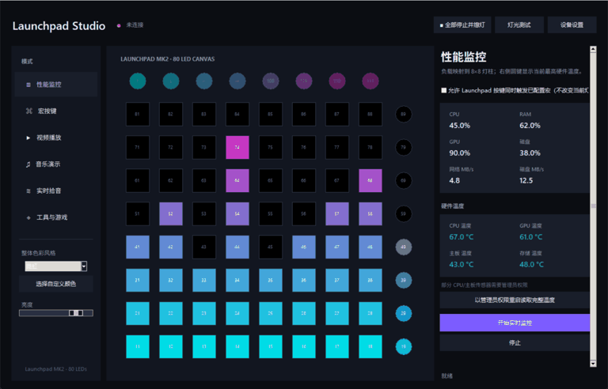](media/launchpad-studio-demo.mp4)

[基础模式总览 MP4](media/launchpad-studio-demo.mp4) 覆盖性能、宏、视频、音乐、拾音、四个工具和四个游戏；**不包含后加入的布局、手机和 VJ**，这些均在下方单独展示。

The core tour covers performance, macros, video, music, live audio, four utilities and four games. Layout, mobile and VJ were added later and have their own previews below.

## 1. 多板布局 / Multi-pad layout

[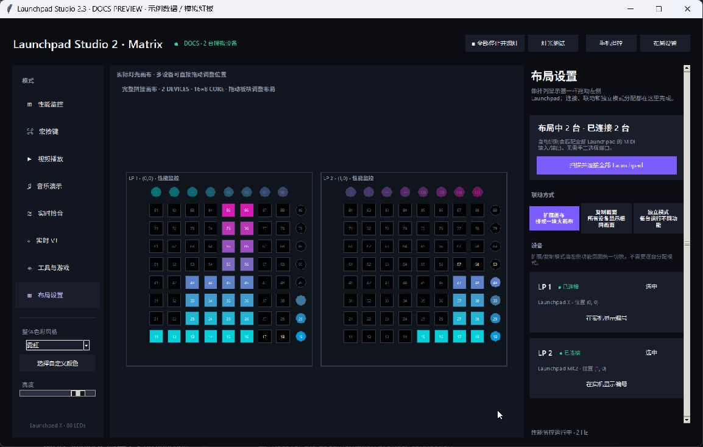](media/layout-demo.mp4)

**[布局截图导览 MP4 / Layout walkthrough](media/layout-demo.mp4)** · [竖向 8×16 截图](media/layout-vertical-2.3.jpg) · [复制模式截图](media/layout-mirror-2.3.jpg) · [独立模式截图](media/layout-independent-2.3.jpg)

入口：布局设置 → 扫描并连接全部 → 选择扩展/复制/独立 → 拖动板块。复制与扩展在各功能页统一开始；独立才显示逐台功能选择。编号灯光用于辨认实体设备，所有模式保留拼接预览。

Entry: Layout Settings → Scan and Connect → Extended/Mirror/Independent → drag tiles. Only Independent exposes per-device function assignment; identical functions still share one engine/settings. The walkthrough shows horizontal extension, mirrored output, independent selectors, position swapping and vertical extension.

## 2. 性能与温度 / Performance and temperatures

[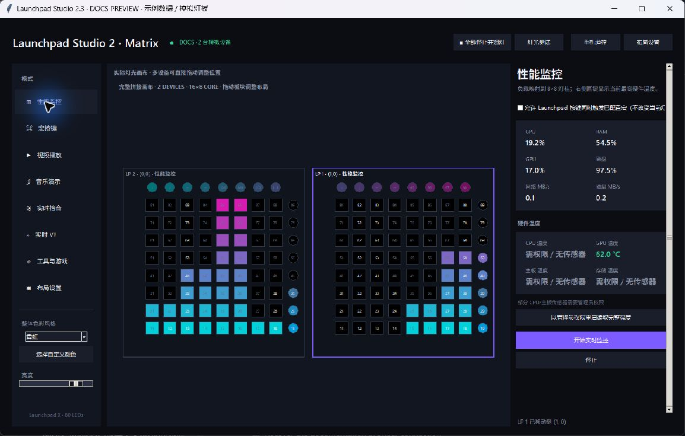](media/performance-demo.mp4)

**[性能灯效预览 MP4 / Performance preview](media/performance-demo.mp4)**（历史单板界面 / legacy single-pad UI）

入口：性能监控 → 开始实时监控。CPU、RAM、NVIDIA GPU、C 盘空间及网络/磁盘吞吐量对应灯柱，可用温度显示在界面。传感器缺失或权限不足会显示不可用；不是所有电脑都能读到全部温度。

Entry: Performance → Start. View load/storage/throughput bars and available temperatures. NVIDIA telemetry and temperature permissions/runtime limits are explained in the user guide.

## 3. 宏按键 / Macro pads

[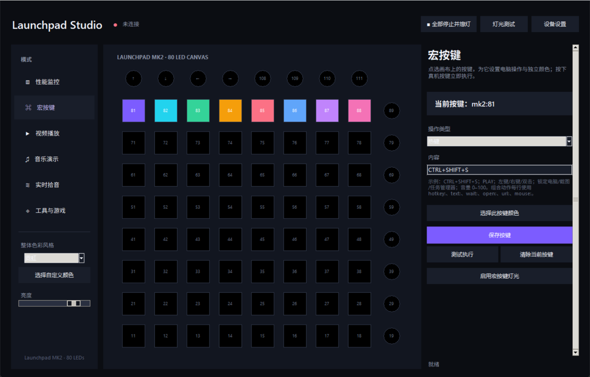](media/macros-demo.mp4)

**[宏功能预览 MP4 / Macro preview](media/macros-demo.mp4)**

入口：宏按键 → 点目标键 → 操作类型、内容、颜色 → 保存。支持十二类动作、测试与单键清除；其他非游戏页面可开启并行宏控制，灯效保持不变。配置按逻辑键位共享，并非每台灯板独立宏库。

Entry: Macros → select a pad → action/value/color → Save. Twelve action categories, per-pad clearing, testing, and optional non-game macro overlay are included. Tests execute real actions: review commands before triggering them.

## 4. 视频像素播放器 / Pixel video

[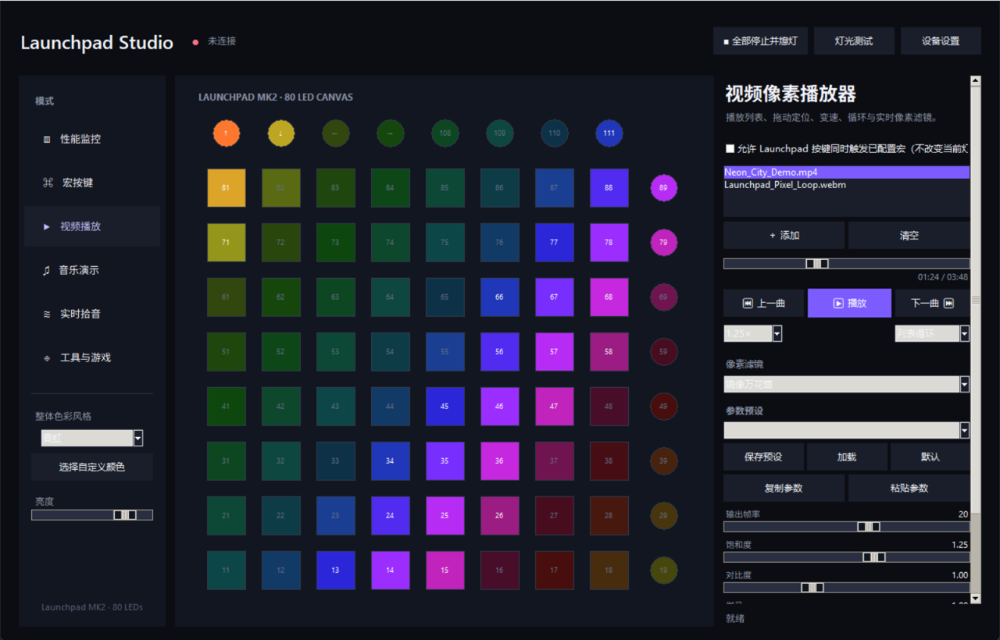](media/video-player-demo.mp4)

**[视频灯效预览 MP4 / Pixel-video preview](media/video-player-demo.mp4)**

入口：视频播放 → 电脑端添加文件 → 播放。展示播放列表、时间轴、上下项、暂停、变速、三种循环与六种滤镜。细节包括 5–30 FPS、饱和度、对比度、伽马和边缘阈值。扩展布局使用更大原生像素区域；视频文件音轨不播放。

Entry: Video → import on the PC → Play. Playlists, seeking, speed, repeat modes and filters drive the native LED canvas. This mode does not play the video's soundtrack.

## 5. 音乐演示 / Music light show

[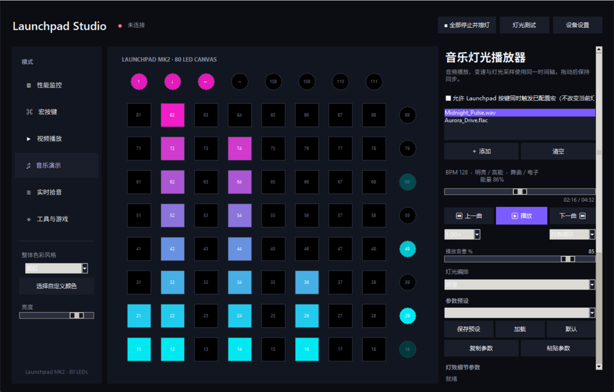](media/music-show-demo.mp4)

**[音乐灯效预览 MP4 / Music-show preview](media/music-show-demo.mp4)**

入口：音乐演示 → 添加音频 → 分析完成后播放 → 选灯效。十种风格包括频谱、波形、涟漪、星云、火焰等；灯光与播放共用时间轴。BPM、风格和情绪是估计，普通音乐模式手动选灯效，变速会改变音高。

Entry: Music → import/analyze → Play → choose a visualizer. Audio and LEDs share a timeline; frequency/loudness/gate settings tune ten styles. Mood/genre are heuristics, not guaranteed classifications or automatic VJ sequencing.

## 6. 实时拾音 / Live audio

[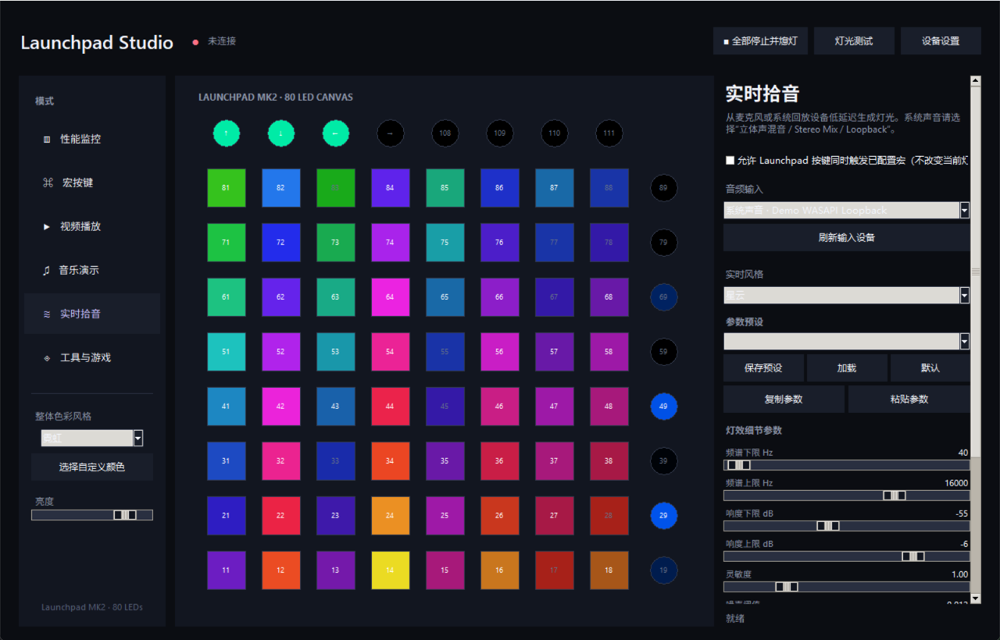](media/live-audio-demo.mp4)

**[拾音灯效预览 MP4 / Live-audio preview](media/live-audio-demo.mp4)**

入口：实时拾音 → 选实际发声的 WASAPI 回放端点或麦克风 → 开始实时灯光。无需导入文件，支持频段、响度、灵敏度、门限、运动速度与扩散。界面延迟值是目标，不是对所有声卡的保证。

Entry: Live Audio → select the correct loopback endpoint or microphone → Start. Capture any external player, with adjustable ranges/sensitivity/gate. Actual latency depends on the device and system.

## 7. 参数记忆与预设 / Saved settings and presets

[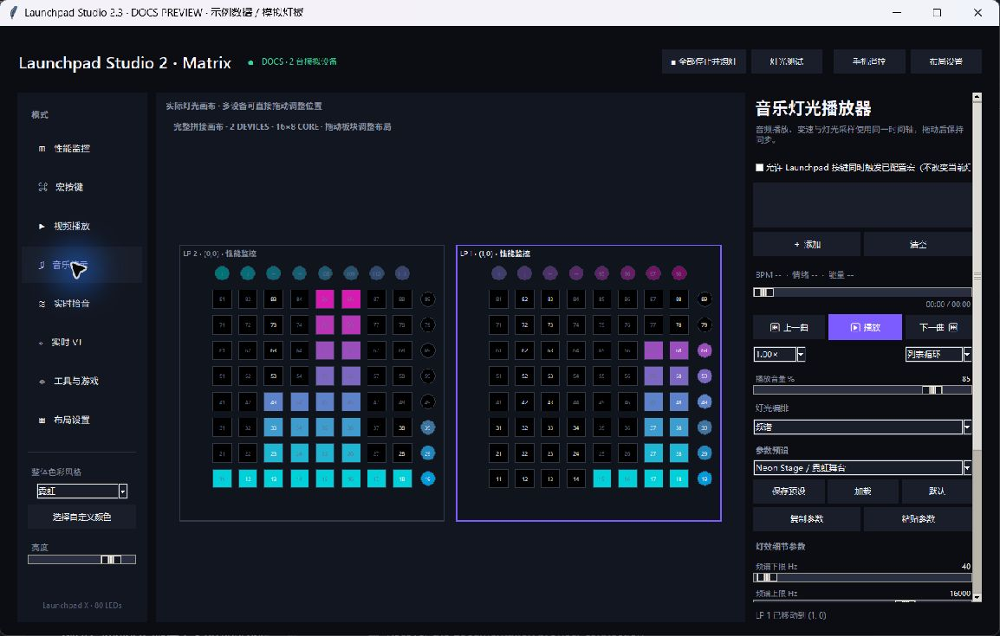](media/presets-demo.mp4)

**[参数截图导览 MP4 / Settings walkthrough](media/presets-demo.mp4)** · [频谱、响度与门限完整截图 / Detailed sliders](media/parameters-2.3.jpg)

入口：音乐/拾音/视频 → 细节调节 → 保存预设 → 命名 → 选择并加载。最近五项优先，音乐与拾音共享音频预设，视频独立；桌面可恢复默认或跨模式复制对应字段。VJ 仅自动记忆，不提供命名预设；手机只有预设保存/加载，没有桌面默认、复制/粘贴按钮。

Tune Music/Live/Video, save a named preset, then select and load it. Desktop defaults/copy/paste act only on compatible fields. VJ settings persist but have no named presets in this version; mobile exposes preset save/load, not desktop reset/clipboard controls.

## 8. GPU 实时 VJ / GPU VJ backgrounds

[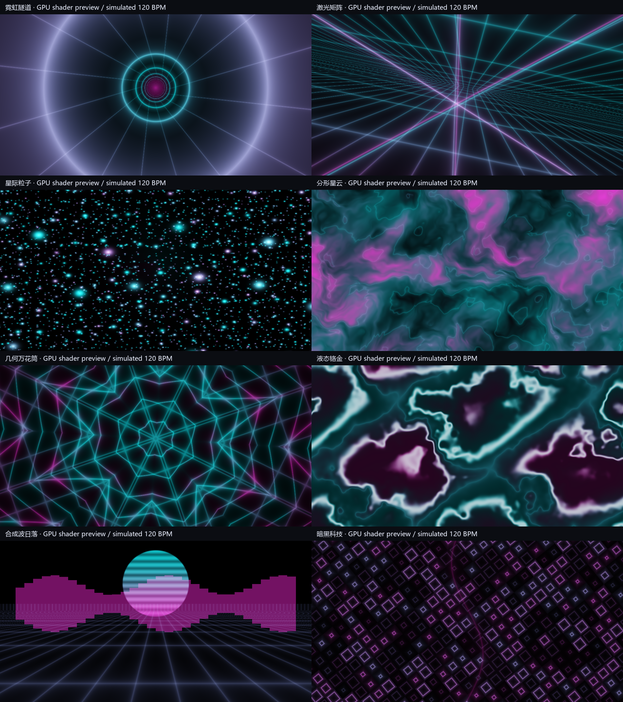](media/vj-demo.mp4)

**[八场景 MP4 / Eight-scene demo](media/vj-demo.mp4)** · [GIF](media/vj-demo.gif) · [当前输出设置](media/vj-controls-2.3.jpg) · [VJ 操作指南](VJ.md)

霓虹隧道、激光矩阵、星际粒子、分形星云、几何万花筒、液态铬金、合成波日落、暗黑科技。入口：实时 VJ → 输入音频 → 固定场景或自动编排 → 画幅、分辨率、帧率及目标显示器 → 开始。

Eight scenes: neon tunnel, laser matrix, particles, fractal nebula, kaleidoscope, liquid chrome, synthwave sunset and dark techno. Select input, style/automatic sequence, aspect/resolution/FPS and output monitors, then Start. Preview/fullscreen and genuine alpha windows are supported; normal HDMI/DP does not transmit separate alpha.

## 9. 原生 VJ 灯板 / Native VJ LEDs

[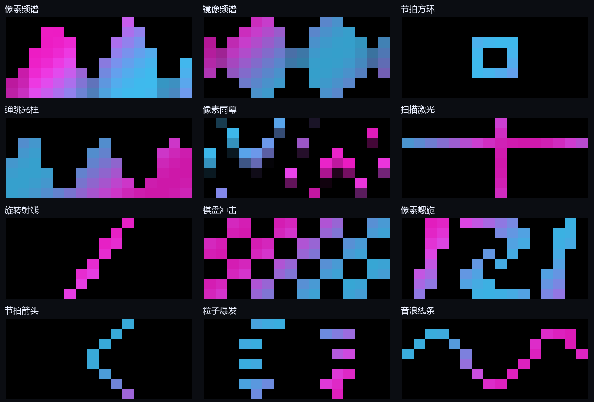](media/vj-led-demo.mp4)

**[十二种灯效与独立投屏 MP4 / Native LEDs and independent screens](media/vj-led-demo.mp4)**

像素频谱、镜像频谱、节拍方环、弹跳光柱、像素雨幕、扫描激光、旋转射线、棋盘冲击、像素螺旋、节拍箭头、粒子爆发、音浪线条。屏幕和灯板分别多选，LED 按所选原生布局分辨率计算；共享色彩与音频特征，不强迫相同图形。对比度与截断让暗像素真正熄灭，可只运行原生灯板。

Multi-select pads separately from screens. LED size follows the selected native geometry without changing screen resolution; native graphics have independent motion/intensity/density/contrast/cutoff. Original-image sampling remains optional and needs a video window.

## 10. 四个桌面工具 / Four desktop utilities

[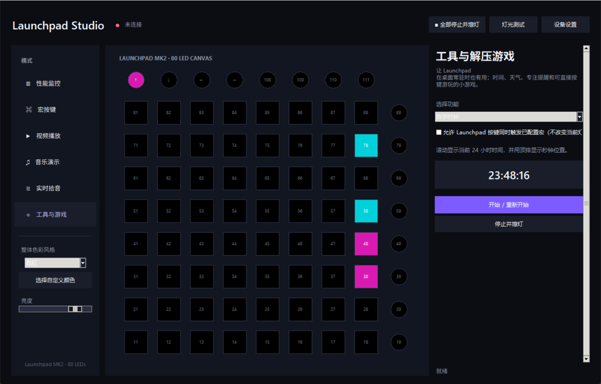](media/desktop-utilities-demo.mp4)

**[时钟、日历、天气、专注 MP4 / Utilities preview](media/desktop-utilities-demo.mp4)**

入口：工具与游戏 → 选具体工具 → 设置 → 开始。数字时钟显示 24 小时时间，日历显示日期/星期，天气输入城市后联网获取气温/体感/湿度/风速/降水概率，专注计时支持 1–180 分钟及暂停、继续、重置。

Choose Clock, Calendar, Weather or Focus Timer, configure, then Start. Weather needs Internet but no API key; Focus supports pause/resume/reset. The video previews all four in order.

## 11. 贪吃蛇 / Snake

[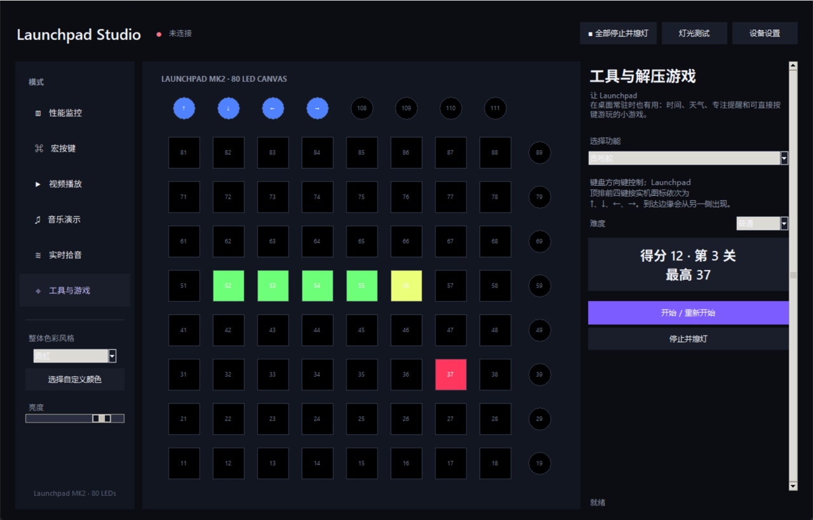](media/snake-demo.mp4)

**[贪吃蛇 MP4 / Snake preview](media/snake-demo.mp4)**

选择难度并开始，用键盘或设备顶排方向键控制。过边界从另一侧出现，撞自身结束；得分提升关卡，计分板实时更新并有吃食物光效。扩展布局增加可游玩的区域，不拉伸方形；游戏输入优先，不开放手机控制。

Choose difficulty and use keyboard or physical directional controls. Edges wrap; self-collision ends the game. Score-driven stages, live scores/high scores and celebration effects are included; extended layouts grow the play area.

所有扩展游戏请使用连续无空洞的矩形排布，避免目标落在没有实体灯板的空位。Use a contiguous rectangular pad layout for all Extended games; targets can otherwise fall in layout gaps.

## 12. 打地鼠 / Whack-a-Mole

[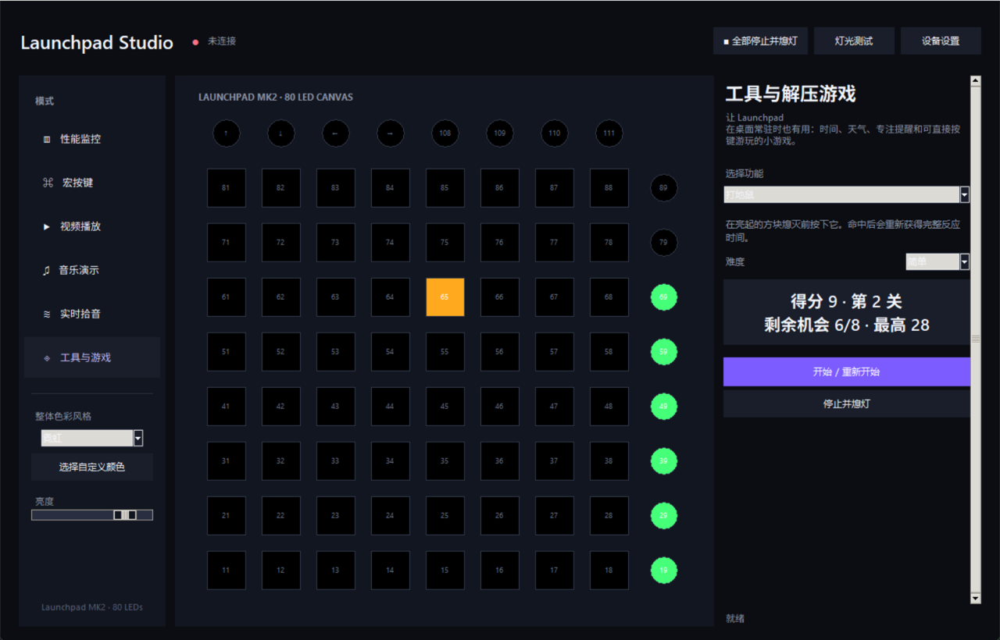](media/whack-a-mole-demo.mp4)

**[打地鼠 MP4 / Whack-a-Mole preview](media/whack-a-mole-demo.mp4)**

选难度并开始，及时按亮起的实体格子。每次命中重置完整反应窗口；关卡、得分、最高分和剩余机会实时显示，命中有庆祝灯效。

Hit lit physical pads in time. Each successful hit grants a fresh response window; difficulty/chances and score-driven stages control pacing, with live score/high score/chances and hit effects.

## 13. 瀑布音游 / Waterfall rhythm game

[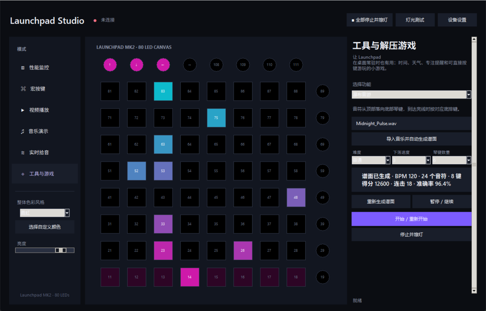](media/waterfall-demo.mp4)

**[瀑布音游 MP4 / Waterfall preview](media/waterfall-demo.mp4)**

入口：工具与游戏 → 瀑布音游 → 导入音乐 → 选难度/键数 → 生成谱面 → 开始。音符下落至判定线，支持 4–8 键、1–5 级速度、暂停/继续，以及判定、连击、准确率与高分；改变谱面相关设置后重新生成。

Import music, select difficulty/lanes, generate the chart before starting. Hit notes at the judgment line; lane/speed controls, pause/resume, grades, combos, accuracy and high scores are included.

## 14. 环形音游 / Radial rhythm game

[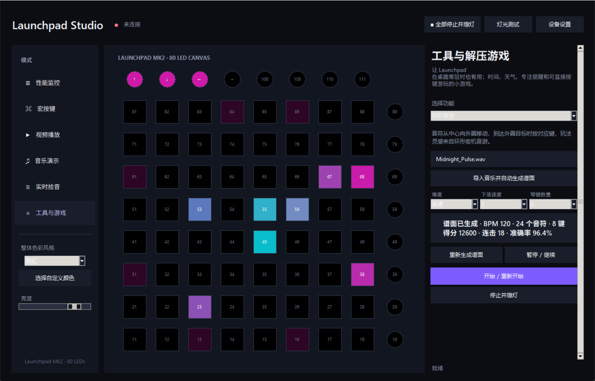](media/radial-rhythm-demo.mp4)

**[环形音游 MP4 / Radial preview](media/radial-rhythm-demo.mp4)**

入口流程同瀑布模式，音符改为从中心向外圈目标扩散。支持相同的难度、速度、键数、暂停与成绩统计，是原创环形街机风格玩法，不附带商业街机素材或谱面。

The same pre-generated-chart workflow, with notes expanding toward outer targets. Matching difficulty/speed/lanes/pause/statistics; no commercial arcade assets or charts are bundled.

## 15. 手机遥控 / Android and browser remote

[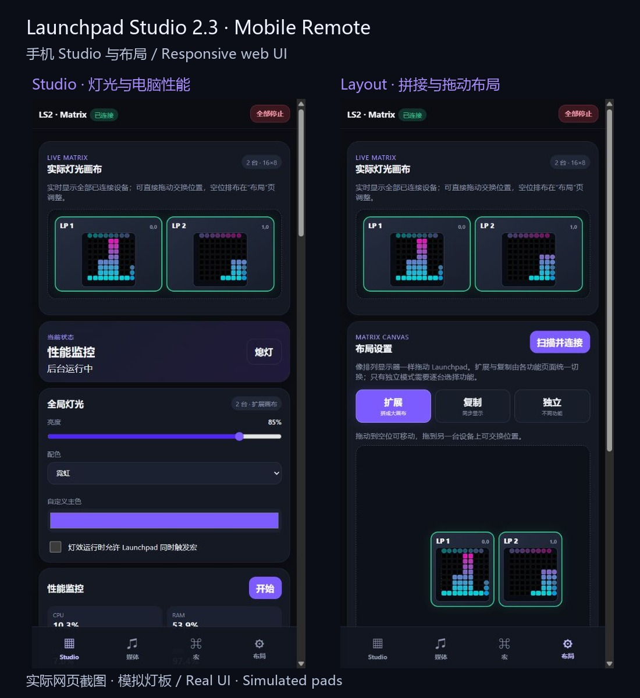](media/remote-demo.mp4)

**[手机截图导览 MP4 / Mobile walkthrough](media/remote-demo.mp4)** · [Studio 全尺寸](media/remote-studio-2.3.jpg) · [布局全尺寸](media/remote-layout-2.3.jpg) · [宏页](media/remote-macros-2.3.jpg) · [VJ 控制](media/remote-vj-2.3.jpg)

同 LAN，在桌面“手机遥控”查看地址/PIN，然后用 Android APK 或浏览器连接。Studio 遥控所有非游戏模式，宏页编辑/触发宏，布局页拖动和分配功能；手机可保存/加载音视频预设，控制屏幕/灯板多选。

The PC hosts the same touch UI for the Android wrapper and browser. Pair on your LAN; use Studio, Macros and Layout for non-game control. Files are imported on the PC; there is no phone upload, PC-audio streaming, standalone MIDI driver or mobile game control.

## 16. Windows 媒体遥控 / Windows media and audio

[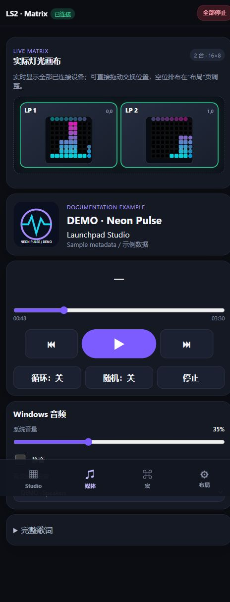](media/remote-demo.mp4)

**[手机导览中的媒体页 / Media in the mobile walkthrough](media/remote-demo.mp4)**

入口：电脑打开兼容播放器 → 手机“媒体”。显示标题、歌手、封面、进度与可查到的同步歌词；控制播放、上下曲、循环/随机、可用时的 seek，以及 Windows 全局音量、静音和默认输出设备。

Open a compatible player on Windows, then use the phone's Media tab. Availability depends on Windows GSMTC: unsupported seek is disabled, lyrics may be missing, and media-key fallback does not guarantee every player capability. The screenshot uses deliberately fictional metadata; controls here are not a recording of player compatibility tests.

## 证据与现场验证 / Evidence and stage checks

当前文档展示功能与操作，不替代实机回归。[VJ 指南](VJ.md#verification--验证) 记录 2.3 的 GPU/进程、Windows 包、Android 与 RC Plus 验证边界；该次新增多板用模拟设备，只有一个实体电脑显示器。旧实机回归见 [RC Plus 测试记录](RC_PLUS_TESTING.md)。在实际 Launchpad、声卡、GPU 和演出屏幕上使用前应再做彩排。

This gallery is not a guarantee of every device, frame rate, audio latency or stage setup. The VJ guide records the actual tested scope, distinguishes simulated-pad tests from historical physical-device results, and states alpha/multi-display limits.
